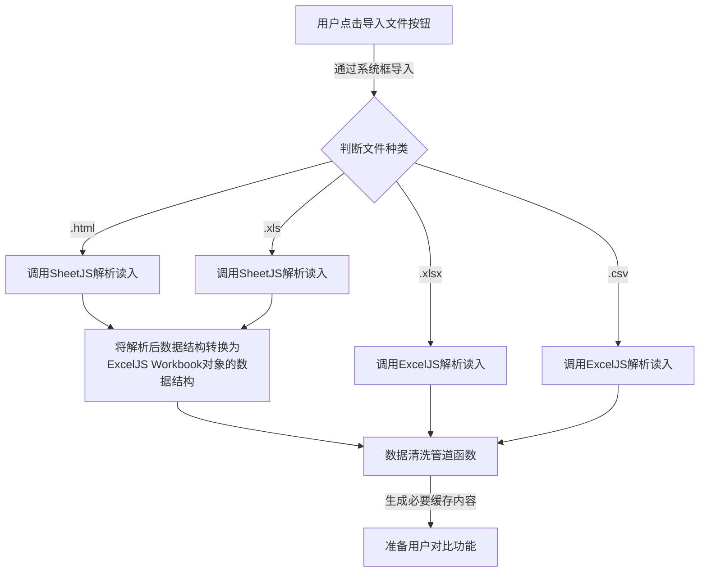

# bom-comparison-vue

一个用于承载和演进当前 BOM 对比逻辑的 Vue 3 + Vite 子工程，并支持一键打包为单个 `index.html`。

## 开发

- 启动开发服务器

```bash
npm install
npm run dev
```

## 构建

- 常规构建（生成标准多文件产物在 `dist/`）

```bash
npm run build
```

- 单文件构建（生成完全自包含的 `dist/index.html`，内联 JS/CSS/资源）

```bash
npm run build:single
```

## 说明

- 单文件模式基于 `vite-plugin-singlefile`，会禁用代码拆分并内联静态资源，适合“小而全”分发场景。
- 如需引入大型三方库，建议评估打包体积与加载时间。

## 业务功能设计

### 模块导入

> 在最后生成的单文件中，确保异步导入 exceljs，sheetjs，Tailwind CSS v3，Font Awesome 6，并满足 src\services\cdn.ts 头部以注释形式提出的要求。

### 预处理流程

> 使用 JS 工具导入时，确保所有单元格以文本类型导入，防止出现一些零件号以 0 开头导致数据丢失。



### 文件解析

用户导入的文件通过 SheetJS（XLS/HTML）或 ExcelJS（XLSX/CSV）进行解析，均转换为统一的 BOMFile 数据结构，供后续处理。

注意：

1. SheetJS 解析如 HTML 时，在转换为 BOMFile 的过程中，会自动删去多余表头、空行、”Design“开头（因其在HTML中为外层 Table，被自动舍去）等无效行。但 ExcelJS 不会，因此需要在解析中同时手动完成清理。
2. ExcelJS 解析合并单元格时，所有被合并单元格都会被置为同一组内容。

### 数据清洗管道

通过 SheetJS 和 ExcelJS 导入数据时，仅会努力导入全部数据，确保每行数据正确，随后进入数据清洗管道完成必要的数据清洗。

> 要处理的数据列至少包括“零件号”、“供应商零件号”、“类型”、“数量”列，其他列非必须。当未找到“零件号”、“类型”、“数量”这三列时，要求程序在适当地方提示解析失败，并提供必要的说明。
> 之后的所有处理都以行作为单位。

#### 预处理流程

1. PN （Part Number）填充

- 若“零件号”列为空但“供应商零件号”有值：将“零件号”列内容填充为带中括号囊括的“供应商零件号”内容，如 `[供应商零件号]`。

2. 关键列规整

- 对“零件号/供应商零件号”两列：
- 删除不可见字符：U+200B..U+200D（零宽）、U+FEFF、U+00AD（软连字符）
- 删除所有空白字符：空格/回车/制表/不间断空格等一律去掉，不保留
- 对“数量”列：
- 将单元格格式转为“数字”格式，以便之后的合并计算

3. WIRE/线束/导线 规范化与聚合

- 若“类型” ∈ {WIRE, 线束, 导线} 且 PN 形如 A-B-C（三段），则规范为 “A-B”，便于聚合
- 按“零件号”聚合（合并计算）：“数量”相加，其它字段保留首行值

4. 排序

- 进行自然排序，按“零件号”升序

### 对比规则与颜色含义

#### 零件号对比

对比以“零件号”为主键，优先级如下（高 → 低）：

1. 零件号命中对表：

- 数量相同 → 绿色（数量相同）
- 数量不同 → 蓝色（数量不同）

2. 零件号未命中对表：

- 若本行“供应商零件号”与对表中“相对于本表为红色的行”的供应商号有交集 → 橙色（供应商匹配）
- 否则 → 红色（未找到）

界面图例对应：

- 红：该行未在对表中找到
- 橙：该行虽未找到，但供应商零件号匹配
- 蓝：该行在对表找到，但数量不同
- 绿：该行与对表中数据一致

> 颜色指示：适用于任何需要图例的地方
>
> ```json
> LIGHT_RED: 'FFFFC8C8',   // #FFC8C8 - 未找到
> ORANGE: 'FFF4B382',      // #F4B382 - 供应商零件号匹配
> LIGHT_BLUE: 'FF99CCFF',  // #99CCFF - 数量不一致
> LIGHT_GREEN: 'FFC8FFC8', // #C8FFC8 - 完全一致
> GRAY: 'FFDCDCDC',        // #DCDCDC - 标题背景
> LIGHT_GRAY: 'FFF0F0F0',  // #F0F0F0 - 表头背景
> ```

### 筛选与排序（UI）

- 列筛选：任意列可下拉筛选，支持搜索、全选、清除；多个列条件按“与”关系组合
- 颜色筛选：对比模式下可在每张表右上角按红/橙/蓝/绿筛选（同一时间每张表最多选一种）
- 排序：对比模式下，界面展示按“颜色优先级（红 → 橙 → 蓝 → 绿）+ 零件号自然排序”

### 导出能力

使用 ExcelJS 导出为 .xlsx，包含以下几种情况：

- 单表导出：原样数据（应用了列筛选但不着色），包含表头、边框与列宽自适应
- 两表导出（未启动对比）：两张原样工作表
- 两表导出（已启动对比）：
  - 两张着色工作表（同时增加“对比标记”列：未找到/供应商匹配/数量不同/数量相同）
  - “对比结果”汇总页：
    - 左右各自的小计（红/橙/蓝/绿行数）与着色数据视图
    - 导线数量差值表（仅类型为 WIRE/线束/导线，且为蓝色类：PN 命中但数量不同）
  - 全部工作表添加边框与列宽自适应，包含图例区域
- 多表（选择表数量 ＞2）导出：
  - 自动进行两两对比
  - 按照两表导出（已启动对比）的形式完成带着色的工作表导出

#### 对启动对比的两表中汇总页的说明

> 在该节所有提到的单元格，均需为其添加边框，同时根据其数据行的颜色指示填充颜色，未提到的单元格不处理，默认。

- 图例（以【单元格：内容 | 单元格背景颜色】格式）
  - A1：图例(相对于对表) | LIGHT_GRAY
  - A3：零件号不存在 | LIGHT_RED
  - A4：虽无零件号，但供应商零件号匹配 | ORANGE
  - A5：数量不同 | LIGHT_BLUE
  - A6：完全一致 | LIGHT_GREEN

- 左右表小计（以【单元格范围：单元格要求】格式）
  - C1：内容为 [左表表名]，GRAY 色
  - C2~F2：颜色依次为红蓝橙绿，内容为各颜色的数据行数
  - C3~F3：为该表表头，内容为”零件号“，”供应商零件号“，“类型”，“数量”。
  - C~F：从第4行开始向下填充数据。
  - 右表与左表要求同理，可使用的列为H~K列。
- 导线长度差值小计
  - M1：内容为“导线长度差值（左表）”
  - M3~Q3：为该表表头，内容依次为“零件号”、“类型”、“本表数量”、“对表数量”、“差值”
  - 完成以上内容后，向下隔一行，继续填充右表的内容，内容同理，表头为“导线长度差值（右表）”
  - 其单元格的颜色根据差值正负填充：正数为浅绿色，负数为浅红色，0 则不填充。

## 已知限制与注意事项

- 仅解析 Excel 的第一个工作表
- 仅对“零件号/供应商零件号”执行字符级规整，其它列原样保留
- 仅可并列对比 2 张表
